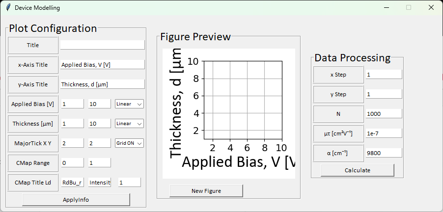
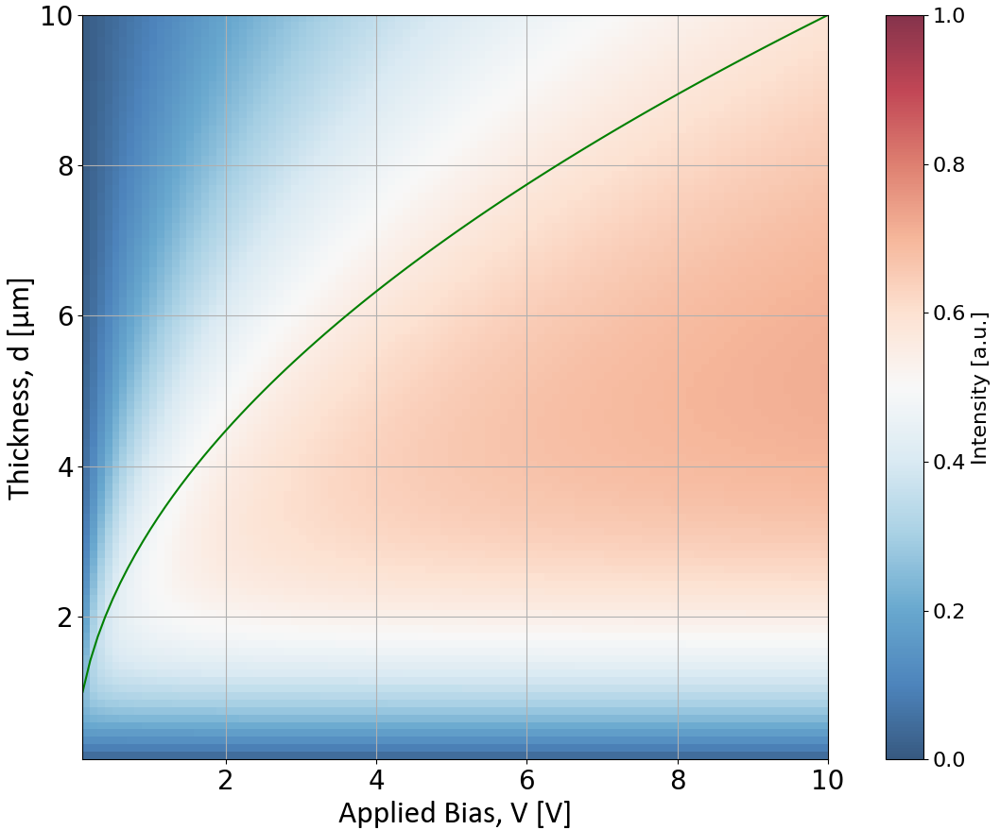

# Design-Photodetector
This Project Aims to Design Photodetector through Calculating Absorption and Charge Collection Efficiency


---
### Assumptions

Generally, the Electric Signal from the Light Absorption in the Optoelectronic Device is Resulted from the Three Physical Phenomena: 
Absorption, Generation, and Charge Collection. Firstly, Light Should be Absorbed within the Homogeneous Medium. 
Secondly, the Number of Charges Generated by Absorbing Light Proportional to the Ionization Energy of Material.
Lastly, Emerging Material like Quantum Dots Holds Short Diffusion Length, however the Thickness should be thick to Absorb enough Light.
Therefore, the Physics of Charge Collection is Dominated with Drift.    

- Assumption 1. Homogeneous and Symmetric Material
- Assumption 2. the Number of Generation depends on the Ionization Energy of Material.
- Assumption 3. Drift Dominant Charge Collection  

---

### Modelling Function

```
Charge Collection Efficiency = Generation × Absorption * Collection
```

- Absorption: Beer Lambert Law, I(r) = I$_0$e$^{-\alpha r}$
- Generation: the Number of Generation, G($\lambda$, W$_±$) = DOS($\lambda$) $\frac {E_{in}(\lambda)} {W_±}$ 
- Collection: Hecht's Equation, $\eta$(E, d, x) = $\frac {\mu \tau E} {d-x} (1-e^{-\frac {d-x} {\mu \tau E}}) $


$$
\lim_{n\to\infty}
\sum_{k=1}^n  DOS(\lambda) \frac {E_{in}(\lambda)} 
{W_±} I_0 \frac {\mu \tau E} {d} 
e^{-\alpha kd/n}(1-e^{-\alpha d/n})
(1-e^{-\frac {d(d-kd/n)} {\mu \tau V}})
$$

---

## How to Use?


### Insert Plot Configuration
1. Type title, x-axis, and y-axis title.
2. Type Applied Bias Range. This range defines Applied Bias. Please Avoid 0V Creating NaN.
3. Type Thickness Range. This is used for sweeping Thickness. Please Avoid 0$\mu$m Creating NaN.
4. Set MajorTick XY for setting interval tick of figure. This does not affect on the result.
5. Set CMap Range, CMap, and CMap title, Ld, respectively. This does not affect on the result.
Ld Indicates whether Drawing Drift Length Limit and it Should be Boolean. 
6. If the Setting of Plot Configuration Parameters is Finished, Click New Figure Button in the Figure Preview Frame.  

### Data Processing Configuration
1. Set interval of x, y within the x-Range, y-Range, respectively.
2. Set N for calculation of convolution. Larger N is more accurate, but slower.
3. Set $\mu\tau$ of the Material.
4. Set Attenuation Coefficients for the Material

### Result


- If the thickness of Light Absorbing Material is thin, Absorption is not sufficient and the intensity is smaller.
- As the thickness is increased, Charge Collectin Efficiency is Increased, However it is Reduced after Drift Length Limit.
- As Bias Increased, Charge Collection Efficiency is also Enhanced due to Increased Drift Current. 

---

## Data Analysis

The Result is automatically copied to the clipboard. The data can be analyzed by preference of user. 
